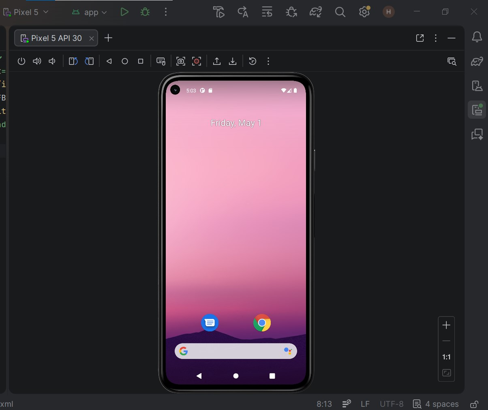
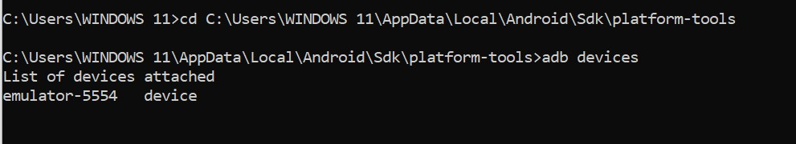
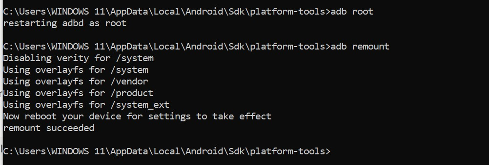
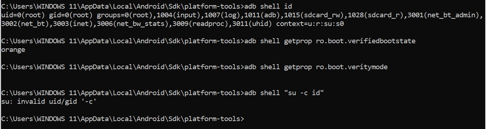
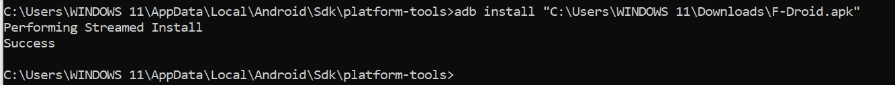
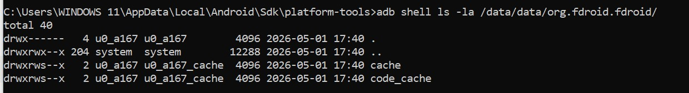
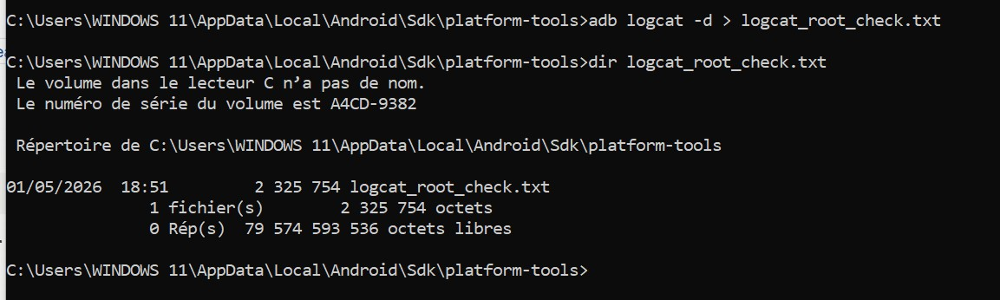
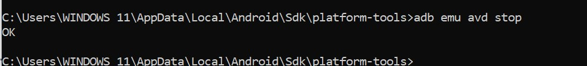

# Lab 2 — Rooting Android & Intégrité Système

## Environnement

- **Support :** Android Studio AVD — Pixel 5 API 30
- **Version Android :** 11 / API 30
- **Application testée :** F-Droid (org.fdroid.fdroid)
- **Données :** fictives uniquement
- **Réseau :** isolé (Host-Only)

---

## Avant de commencer

L'objectif de ce lab est de comprendre ce que le rooting change concrètement sur Android : quels mécanismes il contourne, comment vérifier l'état du système, et comment remettre l'environnement à zéro après les tests.

**Règles appliquées :** aucune donnée réelle, AVD dédié uniquement aux tests, reset obligatoire en fin de session.

---

## Partie 1 — Préparation et connexion

### Lancement de l'AVD avec partitions modifiables

L'émulateur est lancé depuis le terminal avec l'option `-writable-system`. Sans cette option, `adb remount` échoue car les partitions sont montées en lecture seule par défaut.

```bash
emulator -avd Pixel_5 -writable-system
```



### Vérification de la connexion ADB

```bash
adb devices
```

La commande confirme que l'émulateur est bien détecté et prêt.



---

## Partie 2 — Élévation de privilèges

### Activation du mode root et remontage des partitions

```bash
adb root
adb remount
```

`adb root` redémarre le démon ADB avec les privilèges administrateur. `adb remount` remonte ensuite les partitions système en lecture/écriture en désactivant verity automatiquement.



### Vérification de l'état après root

```bash
adb shell id
adb shell getprop ro.boot.verifiedbootstate
adb shell getprop ro.boot.veritymode
adb shell "su -c id"
```



**Interprétation :**

| Commande | Résultat | Signification |
|----------|----------|---------------|
| `adb shell id` | `uid=0(root)` | Accès root confirmé |
| `verifiedbootstate` | `orange` | Le système a été modifié, intégrité non garantie |
| `veritymode` | *(vide)* | Verity désactivé par `-writable-system` |
| `su -c id` | `su: invalid uid/gid` | Normal, le shell est déjà en root |

Le résultat `orange` est particulièrement intéressant : il montre que Android Verified Boot a bien détecté la modification du système. C'est exactement le rôle d'AVB — signaler toute altération même sur un émulateur de lab.

---

## Partie 3 — Tests sur l'application

### Installation de F-Droid

```bash
adb install "C:\Users\WINDOWS 11\Downloads\F-Droid.apk"
```



### Accès aux données privées de l'application

```bash
adb shell ls -la /data/data/org.fdroid.fdroid/
```

Sans root, ce répertoire est totalement inaccessible. Avec root, on peut lire les fichiers internes de n'importe quelle application — ce qui illustre pourquoi le sandboxing d'Android est une protection critique.



### Capture des logs système

```bash
adb logcat -d > logcat_root_check.txt
dir logcat_root_check.txt
```

Le fichier `logcat_root_check.txt` est créé (2 325 754 octets) — il contient les logs système capturés pendant toute la session.



---

## Partie 4 — Remise à zéro

```bash
adb emu avd stop
```

Après l'arrêt de l'AVD, un Wipe Data a été effectué via Android Studio → Device Manager → Wipe Data sur le Pixel_5.



---

## Notions théoriques

### Sécurité Android — 3 piliers

Android repose sur trois mécanismes de sécurité fondamentaux. Le **sandboxing** isole chaque application dans son propre environnement avec un UID Linux unique. Le **modèle de permissions** oblige les apps à demander explicitement l'accès aux ressources sensibles. L'**intégrité système** est assurée par Verified Boot qui vérifie à chaque démarrage que le système n'a pas été altéré.

### Verified Boot & Chain of Trust

Verified Boot garantit que le système démarré est bien celui prévu par le fabricant. Il repose sur une chaîne de confiance : chaque composant vérifie la signature du suivant avant de lui transmettre l'exécution (ROM → Bootloader → Kernel → System → Android). Si une modification est détectée, l'état passe à `orange` ou `red`.

### AVB — Android Verified Boot 2.0

AVB est la version moderne de Verified Boot. Il ajoute la vérification d'intégrité des partitions (system, vendor, boot) et une protection anti-rollback qui empêche de réinstaller d'anciennes versions du système contenant des failles connues.

---

## OWASP MASVS & MASTG

| Référence | Contenu | Ce qu'on peut tester avec root |
|-----------|---------|-------------------------------|
| MASVS-STORAGE-1 | Les données sensibles doivent être chiffrées | Lire `/data/data/[package]/` pour vérifier si les fichiers sont en clair |
| MASVS-NETWORK-1 | Les communications doivent utiliser TLS correctement | Installer un CA système pour intercepter le trafic HTTPS |
| MASTG-TEST-1 | Analyser les SharedPreferences | Inspecter `/data/data/[package]/shared_prefs/` à la recherche de tokens ou mots de passe en clair |
| MASTG-TEST-2 | Détecter les fuites via les logs | Utiliser `adb logcat` pendant l'exécution de l'app pour identifier des données sensibles |

---

## Risques & Mesures

| Risque | Mesure appliquée |
|--------|-----------------|
| Intégrité non garantie → résultats biaisés | AVD propre, aucun résidu d'une session précédente |
| Surface d'attaque élargie | Réseau isolé, aucune connexion externe |
| Exposition de données sensibles | Données fictives uniquement |
| Instabilité de l'émulateur | Snapshot possible avant manipulation |
| Mélange comptes perso / test | Aucun compte Google sur l'AVD |
| Traces après la session | Wipe Data systématique |
| Communications non contrôlées | Mode Host-Only uniquement |
| Absence de traçabilité | Logs logcat + captures horodatées |

---

